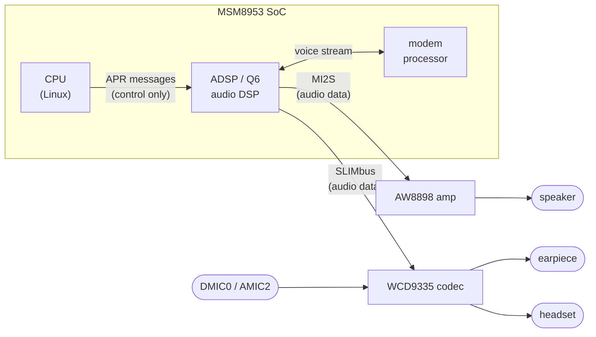
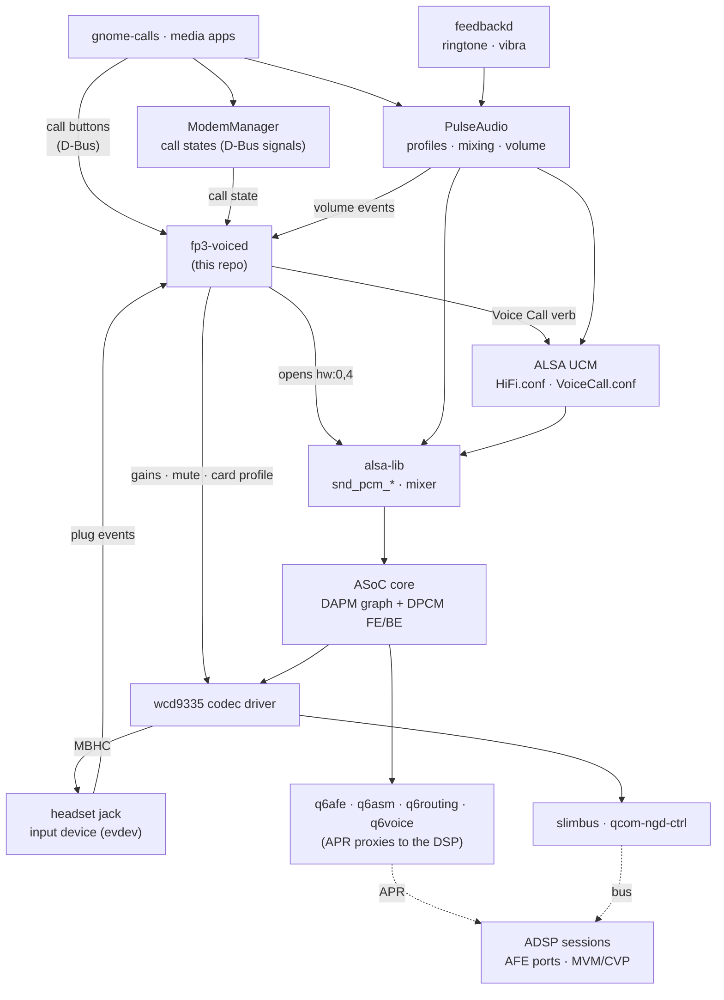
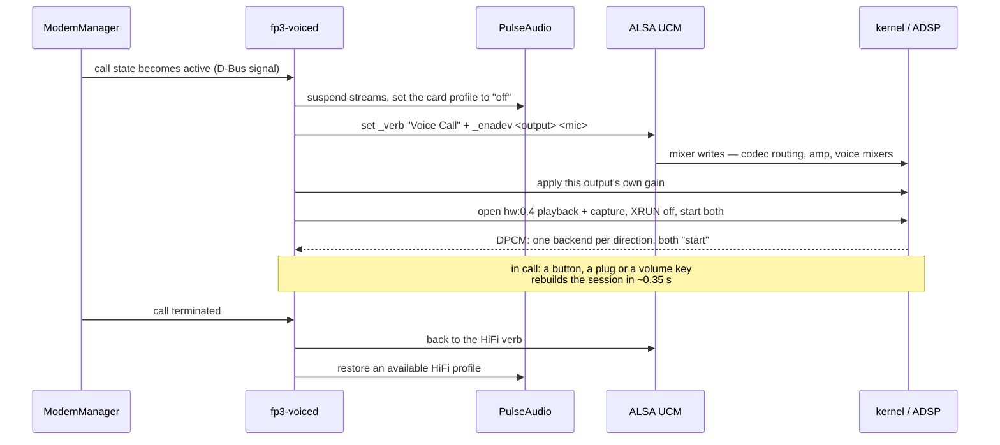

# How audio works on this device

> ⚠️ **AI-generated.** This page — and the code, device tree and tooling it
> describes — was written by Claude (Opus 5) working under the direction of
> Lajosházi, László Gergely, who reviewed every change and made or reviewed
> every measurement it rests on. Kernel commits carry `Co-authored-by: Claude`;
> anything prepared for the LKML carries `Assisted-by:` instead and never a
> `Signed-off-by` from the assistant, since only a human can certify the DCO.

What carries the sound, which piece configures what, and the rules the
arrangement has to obey. For the driver changes behind it see
[`../kernel/README.md`](../kernel/README.md); for the device-tree nodes,
[`../device_tree/README.md`](../device_tree/README.md).

This describes the setup that works today: what carries the sound, which piece
configures what, and the rules the arrangement has to obey. Media playback and
capture go one way through the stack, a phone call goes another; both are
described below.

## The hardware decides the shape of the software



The single most important fact: **audio data does not flow through the CPU.**
The ADSP moves it between the codec, the amplifier and the modem. Linux only
sends control messages ("start AFE port 0x4000", "create a voice session with
this RX and TX port"). Everything else follows from that: Linux and the DSP each
keep their own state, and every piece below exists to keep the two in agreement.

The earpiece, the headset and every microphone hang off the **WCD9335 on
SLIMbus**; only the loudspeaker is elsewhere, on the **AW8898 over Quinary
MI2S**. So a call routed to the earpiece and the same call on speakerphone use
two different buses and two different volume controls.

## The layers



**1. Bus drivers** (`slimbus`, `qcom-ngd-ctrl`). The physical SLIMbus link to the
codec: register access and channel allocation.

**2. Codec driver** (`wcd9335.c`). Everything inside the chip: which microphone
feeds which decimator, which interpolator drives which output, the gain
registers, and headset detection (MBHC). This is where mixer controls like
`RX0 Mix Digital Volume`, `DEC0 Volume` and `DMIC MUX0` come from, and where the
`Headset Jack` switch is reported — both as a mixer control and as an input
device that publishes plug events.

**3. DSP proxies** (`q6afe`, `q6asm`, `q6routing`, `q6voice`). These move no
audio. They send APR commands to the ADSP: start an AFE port, create a voice
session (MVM/CVP) bound to an RX and a TX port.

**4. ASoC core — two state machines.**

* **DAPM** is the widget graph. Mixer controls open and close edges; a path that
  is complete *and* has a running stream gets powered. Ground truth lives in
  `/sys/kernel/debug/asoc/<card>/<component>/dapm/*` (`EAR PA: On`).
* **DPCM** pairs frontends with backends. `hw:0,0` (MultiMedia1) and `hw:0,4`
  (VoiceMMode1) are frontends; `SLIMBUS_0_RX/TX` and `Quinary MI2S` are
  backends. Opening a frontend starts whichever backends the DAPM graph says are
  connected. Ground truth: `/sys/kernel/debug/asoc/<card>/VoiceMMode1/state`.

**5. ALSA in userspace.** `alsa-lib` provides `snd_pcm_*` and the mixer; **UCM**
turns dozens of mixer writes into named use cases (`HiFi`, `Voice Call`) and
devices (`Earpiece`, `Speaker`, `Headphones`, `Mic`, `Headset`). UCM only sets
controls — it starts nothing.

**6. PulseAudio.** Loads the card, turns UCM verbs into card profiles, creates
sinks and sources, mixes applications and applies volume. It owns everything
that is *not* a call: media, notifications, and the ringtone.

**7. The daemons above it.** ModemManager owns the call state machine;
gnome-calls presses the in-call buttons over D-Bus; feedbackd plays the ringtone
and drives the vibrator; **`fp3-voiced`** (this repo) owns the call audio.

## The two paths

**Media** is the ordinary one: an app plays into PulseAudio, PulseAudio mixes it
into the sink that the active UCM device describes, and the stream reaches the
codec (or the amplifier) through `hw:0,0`. Volume is applied by PulseAudio on
the `PlaybackVolume` control named by the UCM device.

**A call** never passes through PulseAudio at all — the audio goes
modem ↔ ADSP ↔ codec, and the CPU's only job is to set the routing up and hold
the voice frontend open. That is `fp3-voiced`:



## The headset jack

Detection is done by the WCD9335's MBHC block, through the kernel's shared
`wcd-mbhc-v2` implementation. Nothing about it comes from upstream: the pre-port
`sdm632-fairphone-fp3.dts` described the AW8898 loudspeaker and no codec at all,
so there is no mainline reference for a jack on this phone.

**How it works.** The codec's L_DET block raises an interrupt when a plug moves
in the socket, and the shared code takes the direction of that edge from the
codec's own arming bit, `MECH_DETECTION_TYPE`, rather than from anything the
driver remembers. On an insertion it starts a detection that lasts up to three
seconds: the hardware FSM drives a current source into the jack and the driver
watches three comparator outputs — `HS_COMP_RESULT` and the HPHL and MIC Schmitt
triggers — re-toggling the FSM between readings until the plug type settles. A
button that is already down when the FSM starts is what separates a three-pole
headphone, whose microphone pin is shorted to ground, from a four-pole headset.
The result is reported as `SW_HEADPHONE_INSERT` and `SW_MICROPHONE_INSERT`, and
`fp3-voiced` picks the call's output and input from the two.

Nothing in the board file describes the jack. Both switches are normally open,
which is what the shared code assumes when neither
`qcom,hphl-jack-type-normally-closed` nor `qcom,ground-jack-type-normally-closed`
is present.

**What is measured to work**, over a deliberate sequence of ten physical
movements with both a 3-pole and a 4-pole accessory:

| stimulus | reported |
|---|---|
| empty socket at boot | nothing inserted |
| 4-pole headset | headphone, microphone, physical insert |
| 3-pole headphone | headphone only |
| headset button, short press | `KEY_MEDIA` press and release |
| removal, either accessory | all switches cleared, **no key event** |

- **no interrupt is lost**: ten movements produced exactly ten interrupts;
- the plug type is decided by measurement, not assumed — the two accessories
  give different answers while `RESULT_3` reads the same for both, so the
  discrimination comes from the detection algorithm rather than from a status
  bit;
- no stored insert state exists to drift, so the inversion that used to strand a
  whole boot in the wrong state has no mechanism left;
- **removal produces no spurious key press.** The private implementation needed a
  hand-rolled 120 ms debounce here, because unplugging tripped the button
  comparator before the mechanical detection noticed and userspace saw a complete
  media-key tap - enough to start a music player. Two full cycles produced key
  events only from actual presses.

Only one of the two `Fairphone 3 Headset Jack` input devices carries anything;
the second stays silent.

**What is not established.** `RESULT_3` reads `0x10` with the socket empty and
`0x00` with a plug in, which looks like an absolute plug status — but in every
sample taken so far `MECH_DETECTION_TYPE` moves with it, and that coupling is
exactly what made the same register untrustworthy before. Separating the two
would need a sample where the arming bit is held while the socket changes, and
there is none. Nothing in the current arrangement depends on the answer.

There is no board jack-detect GPIO to fall back on, unlike the msm8916/msm8953
boards using the PMIC-internal codec — established from the device trees in the
stock firmware, not merely from source.

The route taken here, including the private implementation this replaced and the
hypotheses that were disproven on the way, is in [`bringup/jack/`](bringup/jack/).

## What each piece in this repo contributes

| path | what it does |
|---|---|
| `userspace-audio/ucm2/Fairphone/fp3/HiFi.conf` | media use case: the sinks and sources PulseAudio exposes, with their `PlaybackVolume` controls and the jack each one follows |
| `userspace-audio/ucm2/Fairphone/fp3/VoiceCall.conf` | the call use case: codec routing per output (`Earpiece`, `Speaker`, `Headphones`) and per input (`Mic`, `Headset`), plus the voice mixers. Every output also **drops the other outputs' routes and gains**, and the capture devices deliberately have **no `CapturePCM`** — the call's uplink is not a PulseAudio source |
| `userspace-audio/ucm2/conf.d/Fairphone_3/Fairphone_3.conf` | registers both verbs — a verb that is not listed here does not exist as far as PulseAudio is concerned |
| `userspace-audio/systemd/fp3-voiced` (+ `.service`) | the call-audio daemon described above. Replaces `q6voiced` (`Conflicts=`), which neither applies the routing nor starts the streams — and which stays installed regardless, because the `soc-qcom-msm8953-modem` meta-package depends on it |
| `userspace-audio/systemd/fp3-mic-select` (+ `.service`) | picks the built-in microphone for media capture at boot |
| `userspace-audio/pulse/90-fp3-mic.pa` | PulseAudio drop-in for the capture side |
| `userspace-audio/udev/61-fp3-vibra.rules` | tags `pm8xxx_vib_ffmemless` so feedbackd may use it — without it an incoming call is silent *and* still |
| `userspace-audio/q6voiced-start-streams.patch` | not installed: the fix an earlier round made to postmarketOS's `q6voiced`, kept because the bug it describes is not specific to this phone |

## The rules this arrangement obeys

These are the constraints that make the difference between a working call and a
silent one; each is enforced somewhere in the code above.

1. **The voice path configures the AFE port first.** Whoever starts a shared AFE
   port configures it; a later start only answers `ADSP_EALREADY` and gets the
   first one's configuration. So PulseAudio is asked to let go of the card
   *before* the Voice Call verb is applied.
2. **PulseAudio gives the card up for the duration of the call.** Suspending its
   streams is not enough — a suspended sink is resumed by any client that wants
   to play — so the card profile goes to `off` and is restored afterwards. It
   must never be handed a Voice Call profile: its media sink would open on the
   call's own SLIMbus backend.
3. **Volume is mirrored, not delegated, and is per output.** Because of rule 2,
   `fp3-voiced` applies the level to the gain that is really in the path:
   `RX Volume` (AW8898) on speakerphone, `RX0 Mix Digital Volume` for the
   earpiece, `RX1`+`RX2` for headphones — each with its own range, since +26 dB
   is comfortable against the ear and painful inside it. Every output keeps its
   own level, so plugging a headset into a loud speakerphone call is safe.
4. **The playback leg starts with XRUN detection off.** The voice PCM carries no
   data, so the ALSA core refuses to start an empty playback stream unless
   `stop_threshold` is set to the buffer boundary. Without this the downlink is
   silent while everything else looks correct.
5. **Changing the output is a full teardown.** The ADSP binds the voice session
   to the RX port it was given at creation, so a speakerphone toggle or a jack
   event goes back to the `HiFi` verb and builds the session again — measured at
   0.31–0.34 s end to end.
6. **Each UCM device cleans up after the others.** `alsaucm` is a fresh process
   every time it runs, with no memory of the device enabled before, so a
   `DisableSequence` never runs across invocations. Enabling an output therefore
   zeroes the other outputs' routes *and* gains itself; without that the voice
   frontend ends up with two backends and `hw_params` fails with `-22`.
7. **The microphone follows the jack, not the output**, and **mute is a gain, not
   a route**. A headset stays the input even on speakerphone. Muting by taking
   the microphone out of the DAPM graph silences it permanently on this codec —
   measured: the level goes to exactly zero and stays there for the rest of the
   boot, through a fresh PCM open and a full re-apply of the routing. `DEC0
   Volume` (a kernel control this port adds) is reversible.
8. **Everything is restored on the way out** — the `HiFi` verb and a HiFi profile
   PulseAudio reports as *available* — and the same cleanup runs at startup and
   periodically while idle, because the user's PulseAudio only appears when the
   phone is unlocked and comes back with whatever profile it remembered.
9. **Nothing is polled that the system publishes.** The jack is an input device,
   ModemManager signals call state on the system bus, and PulseAudio publishes
   volume changes: the daemon watches all three and asks nothing until something
   moves. Idle cost is about 0.1% of a CPU.

## ☠️ One known defect, and it is not in this port's code

**The SoC's internal digital codec pins the audio DSP awake for the whole boot.**
Found from the power side on 2026-08-20 and recorded here because this is where
anyone touching audio will look.

`c0f0000.codec` — bound to `msm8916-wcd-digital-codec`, the *internal* digital
codec, which is **not** in this phone's audio path — holds two clocks from probe:

```
LPASS_CLK_ID_INTERNAL_DIGITAL_CODEC_CORE  enable=1 prepare=1  19200000 Hz  mclk
xo                                        enable=7            19200000 Hz  ahbix-clk
```

`msm8916_wcd_digital_probe()` calls `clk_prepare_enable()` on both unconditionally
and releases them only in `remove()` — no runtime PM, no DAPM gating. The `mclk`
is supplied by the ADSP over APR, so the ADSP cannot power-collapse while it is
held. Measured consequence: the DSP shuts down two or three times in the first
seconds of a boot and then never again, until something restarts it.

**Why it matters here even though it costs almost nothing.** The power side prices
the whole mechanism at about 4 % of the sleep current, so this is not a
battery-life item. It matters because it is a **standing hardware request that no
audio path asks for**, on a board where that codec is unused: playback and capture
run over the WCD9335 on SLIMbus and the AW8898 on MI2S.

☠️ **It is not caused by this port's MCLK routing, and that was checked rather
than assumed.** The two routes this port added — `"AMIC2", "MCLK"` and
`"AMIC5", "MCLK"` — are DAPM routes on the *WCD9335*, a different device. At idle
the WCD9335's own `MCLK` supply widget reads `Off` and both PulseAudio sources are
`SUSPENDED`, while the internal codec's clock count is still 1. A clock held
outside DAPM cannot be released by anything DAPM does.

The fix, and the confirming measurement, are tracked in
[`../TODO.md`](../TODO.md); the evidence is in
[`../power/bringup/leads/lpass-never-sleeps.md`](../power/bringup/leads/lpass-never-sleeps.md).

## Checking it works

| what to look at | what it should say |
|---|---|
| `journalctl -u fp3-voiced -b` | the call state, `call audio up (<output> + <mic>)`, and a `dpcm:` snapshot every ten seconds |
| `/sys/kernel/debug/asoc/<card>/VoiceMMode1/state` | exactly one backend per direction, both `start` (`Quinary MI2S` on speakerphone, `SLIM Playback` otherwise) |
| `dmesg` | no `AFE enable ... failed` |
| `pactl list cards \| grep 'Active Profile'` | a `HiFi` profile whenever no call is up — never `off`, never `Voice Call` |
| `gsettings get org.sigxcpu.feedbackd profile` | `full` — `quiet` mutes the ringtone |
| `amixer -c 0 cget name='RX0 Mix Digital Volume'` | tracks the volume keys during an earpiece call |

## How it was arrived at

This page describes the working arrangement. How that arrangement was found —
what was believed at each step, what was measured, and the several confident
conclusions that had to be retracted — is a separate document:

* [`bringup/README.md`](bringup/README.md) — the narrative, with the
  instruments and the two-sided register dumps that produced it
* [`bringup/qdsp6ss-framer-poke.md`](bringup/qdsp6ss-framer-poke.md) — the
  QDSP6SS register the kernel wrote on every boot to make the SLIMbus framer
  answer, why it looked necessary, and the measurement that retired it
  (removed 2026-07-29)

After editing any UCM file, restart PulseAudio (`pulseaudio -k`) — it reads the
sequences when it loads the card, so a running instance still applies the old
ones. And note that while the screen is locked the *greeter* runs its own
PulseAudio: a `pactl` aimed at the user's runtime directory then talks to an
autospawned empty daemon, which looks exactly like "the card lost its sink".

## 2026-09-05 — the AFE service api_version this ADSP reports

`api_version = 2`, `api_branch_version = 0`, query successful. It is the number
the generic q6afe clock-set redesign (Otto Pflüger's D-2 3/4, not in mainline)
has to dispatch on, and nothing in our tree prints it — read with a kretprobe on
`q6core_get_svc_api_info()` triggered by an APR-bus rebind of the AFE service,
no rebuild and no flash.

☠️ **Do not repeat the method casually: the rebind wedges the AFE ports.**
`fail to start AFE port 7f`, `ASoC error (-110) on QUIN_MI2S_RX`, and a second
rebind did not clear it — it took a reboot. If the number is wanted again, fold a
one-line `dev_info` into `q6afe_probe()` on the next flash instead.

☠️ The first read was one struct field out and would have been reported as
`api_version = 0`. Both 0 and 2 are plausible values, so nothing about the wrong
number looked wrong; it was caught by reading `q6core.h`, and the corrected read
carries two checks — `ret=0` (the service was found) and `f_svc=0` (a field the
function never writes).

[`bringup/captures/2026-09-05_130-afe-api-version/`](bringup/captures/2026-09-05_130-afe-api-version/README.md)
