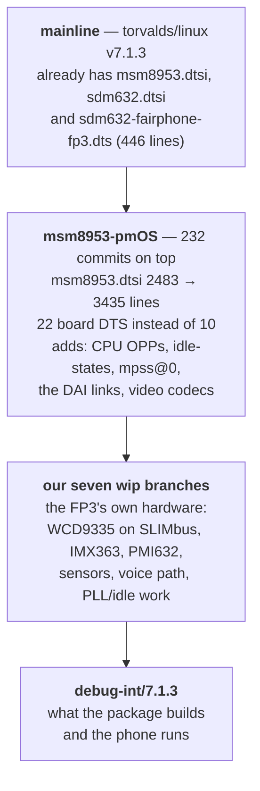
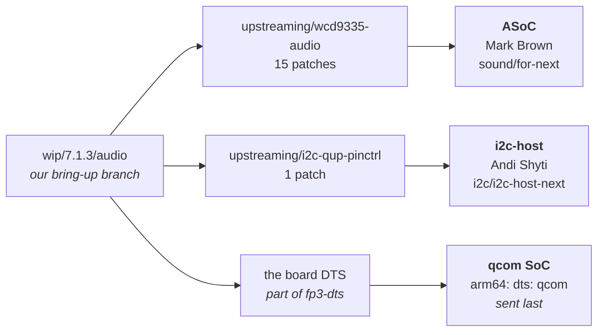
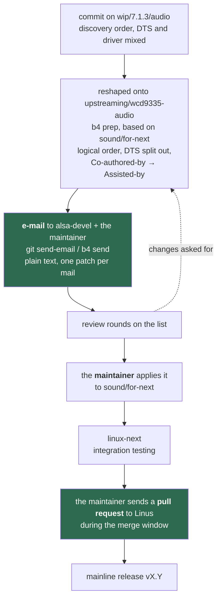
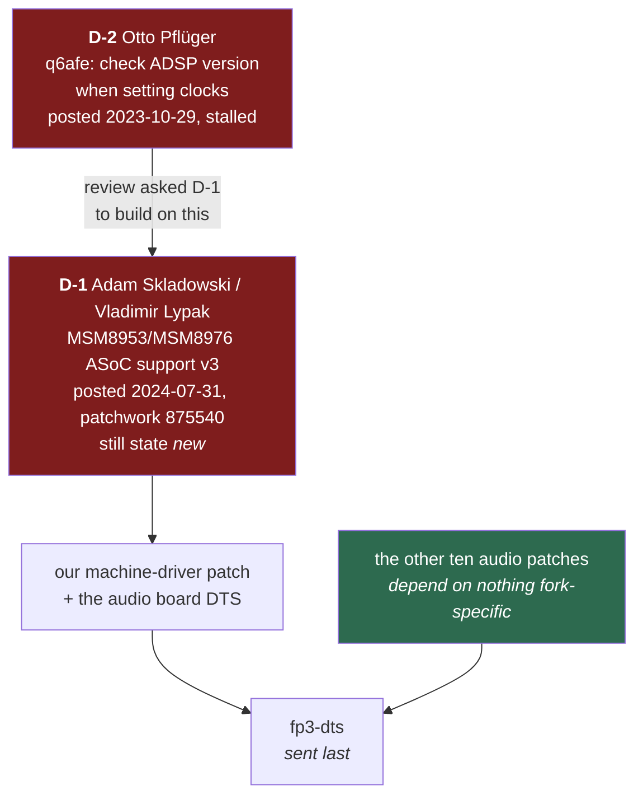
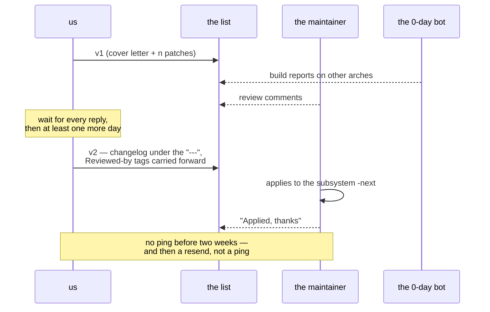

# Upstreaming, explained from the beginning

> ⚠️ **AI-generated.** This page — and the code, device tree and tooling it
> describes — was written by Claude (Opus 5) working under the direction of
> Lajosházi, László Gergely, who reviewed every change and made or reviewed
> every measurement it rests on. Kernel commits carry `Co-authored-by: Claude`;
> anything prepared for the LKML carries `Assisted-by:` instead and never a
> `Signed-off-by` from the assistant, since only a human can certify the DCO.

Read this end to end and you should be able to say, for any piece of the port:
what it is, which tree it belongs to, what it depends on, where it came from,
and when it can be sent. It is the *explanation*; the current state of each
series is in [`../README.md`](../README.md), and the method — the traps, the
checklists, the commands — is in the `/msm8953-mainline-pr` skill.

The order below is deliberate. Sections 1–3 are vocabulary, 4–6 are the shape of
the world, 7–9 are our situation in it, and 10 is what to actually do.

---

## 1. The one-sentence version

We changed a kernel to make a phone work; upstreaming means handing those
changes to the people who maintain that kernel, in the form they use, so that
they carry them from now on instead of us.

Everything else in this document follows from two facts: **the kernel is not one
repository but a few hundred**, and **a patch is an argument, not a delivery.**

---

## 2. What the pieces are called

Grouped by where you meet them, not alphabetically.

### The hardware description

| term | what it is | why it matters here |
|---|---|---|
| **DT** — device tree | Data, not code: which chips are on this board, at which address, on which bus, wired to which pins, clocks and supplies. The kernel reads it at boot. | It is why one kernel binary runs on many boards. Our board's audio wiring is a DT change. |
| **`.dts`** | The source file for one board — `sdm632-fairphone-fp3.dts`. | This is *our* board file. It is already upstream; we add nodes to it. |
| **`.dtsi`** | A shared include: SoC-level (`msm8953.dtsi`) or PMIC-level (`pm8953.dtsi`). | Facts true of every board with that chip live here, not in the board file. |
| **`.dtb`** | The compiled binary the bootloader hands the kernel. | What actually ships; `/boot/…dtb` on the device. |
| **node / property** | A node is a device (`nfc@8`); properties describe it (`compatible`, `reg`, `interrupts`, `status`). | `compatible` is the string a driver binds to. `status = "disabled"` means "described but not brought up here". |
| **binding** | The YAML schema in `Documentation/devicetree/bindings/…` saying which properties a given `compatible` may have, of what type, which are required. | The contract between DT and driver. A property with no binding formally does not exist, and fails validation. |
| **`dt_binding_check`** | `make` target that validates a binding and compiles its example. | Run it on any binding you touch. |
| **`dtbs_check`** | `make` target that validates real board DTs against the bindings. | A commit that adds warnings here can be reverted. ☠️ An undocumented `compatible` is skipped *silently*, so a clean run can mean nothing was checked. |

### The audio stack (because that is our first series)

| term | what it is |
|---|---|
| **ASoC** | ALSA System on Chip — the kernel's framework for embedded audio. Splits a sound card into three parts: |
| **codec driver** | The chip that converts between digital audio and analogue — for us `wcd9335.c`. Knows nothing about which phone it is in. |
| **platform driver** | The SoC's audio hardware — DMA, the DSP front ends. For us the `qdsp6` family. |
| **machine driver** | The board-specific glue that says *this* codec is wired to *that* platform through *this* link — for us `apq8016_sbc.c`. |
| **DAI** | Digital Audio Interface — one end of an audio link. A "DAI link" joins a CPU-side DAI to a codec-side DAI. |
| **DAPM** | Dynamic Audio Power Management — the graph of widgets (mixers, muxes, supplies) that ASoC powers up and down as routes become active. Most "no sound" bugs are a missing DAPM route. |
| **PCM** | The stream itself — what an application opens to play or record. A "front end" PCM is what userspace sees; a "back end" is the hardware link behind it. |
| **kcontrol** | A mixer control (`amixer`, `alsamixer`) — a switch, an enum or a gain. |
| **SLIMbus** | Serial Low-power Inter-chip Media Bus. The bus between the SoC and the WCD9335 on the FP3. Unusual on this SoC — every other MSM8953 board uses MI2S. |
| **MI2S** | The plain multi-channel I²S audio link. The FP3 uses it for the speaker amplifier, on the *quinary* instance. |
| **LPASS** | Low Power Audio SubSystem — the audio island inside the SoC, containing the DSP and the interfaces. |
| **ADSP / Q6 / QDSP6** | The Hexagon audio DSP inside LPASS, running its own firmware. Much of "the audio path" is code we do not have, on a processor we do not control. |
| **q6afe / q6asm / q6adm / q6routing** | The kernel's drivers for the ADSP's services: AFE = the ports to the outside world, ASM = stream management, ADM = the routing matrix. Our `q6afe` patch is in the first. |
| **AFE port** | One endpoint on the ADSP — e.g. `SLIMBUS_0_RX` (playback towards the codec). Several streams can share one. |
| **MBHC** | Multi-Button Headset Control — the codec block that detects what is plugged into the 3.5 mm jack (headphone / headset / line-out / mis-wired) and decodes the headset's buttons, which are physically resistors on the mic line. |
| **OCP** | Over-Current Protection — the fault interrupts the headphone amplifier raises. The shared MBHC code requires them. |

### The submission machinery

| term | what it is |
|---|---|
| **LKML** | The Linux kernel mailing list. In practice you send to the *subsystem's* list, Cc LKML. |
| **lore** | The public archive of those lists — every message has a permanent URL by message-id. |
| **patchwork** | The tracker that turns list traffic into patch states (`new`, `superseded`, `accepted`, `not-applicable`). Has a JSON API, which is how we query it. |
| **`b4`** | The tool that fetches a series from lore, applies it, tracks dependencies and sends revisions. |
| **DCO** | Developer Certificate of Origin — the legal statement `Signed-off-by:` makes. Only a human can make it. |
| **`Signed-off-by:`** | "I have the right to submit this." Mandatory on every commit. Never from the AI. |
| **`Assisted-by:`** | The trailer for AI-assisted work, per `coding-assistants.rst`. Ours reads `Assisted-by: Claude:claude-opus-5`. |
| **`Fixes:`** | Names the commit that introduced the bug, as `<12-hex> ("subject")`. Comes from `git blame`, never from guesswork. |
| **`Cc: stable@vger.kernel.org`** | Asks for the fix to be backported to stable releases. For user-visible bugfixes. |
| **`Link:` / `Closes:`** | A URL that adds something the commit does not contain / a public bug report being fixed. Private trackers are forbidden. |
| **RFC** | `[RFC PATCH]` — "I want design feedback, this may not be final." The honest label for a first series that has known gaps. |
| **`-p1`** | The path depth of a diff: rooted at the kernel tree, which is what `git format-patch` produces. |
| **checkpatch / sparse / coccicheck / `W=1`** | The mechanical checkers: style, type and endianness errors gcc cannot see, semantic patterns, and the warnings gcc suppresses by default. |

---

## 3. The trees, and why there are so many

There is no single "the kernel repository" you push to. There is a hierarchy,
and a patch climbs it:

```
   you  →  a mailing list  →  a subsystem maintainer's tree  →  linux-next  →  Linus  →  a release
                                   (e.g. broonie/sound.git)      (daily integration)
```

Inside a maintainer's tree there are several branches, and their names mean
things. Measured on `broonie/sound.git` (the ASoC tree) on 2026-08-29:

| branch | meaning |
|---|---|
| `for-linus` | fixes going into the release that is currently out |
| `for-next` | what is queued for the **next** merge window; feeds linux-next |
| `for-7.0` … `for-7.3` | per-release accumulation branches |

☠️ **`for-next` is not "the future".** It exists now, you can clone and boot it.
"Next" says which release it is destined for. It *moves daily*, which is why a
test result against it is only meaningful together with the exact commit — and
that is what `git format-patch --base=` records for you, as a `base-commit:`
line in the cover letter.

**linux-next** is the daily merge of nearly every subsystem tree. It is where
your patch meets everyone else's, and where cross-tree breakage is found by
build bots before Linus ever sees it. This is why nobody expects *you* to have
tested against every other subsystem: that job is done downstream of you.

---

## 4. Time: the release cycle

A kernel release takes about nine or ten weeks, in two phases:

1. **Merge window — two weeks.** Linus pulls from maintainers. It opens the day
   the previous release is tagged. ☠️ **Do not send patches during it**; they
   will sit until it closes, and asking why is the classic way to annoy a
   maintainer.
2. **`-rc` phase — about seven weeks.** `-rc1` … `-rc7`, then the release. This
   is when you send. The maintainer applies your patch to the branch for the
   *next* release, and it rides into the following merge window.

So the number you are aiming at is always one release ahead of the one being
stabilised. The state is one command away:

```sh
curl -s https://www.kernel.org/releases.json |
  python3 -c 'import json,sys; r=[x for x in json.load(sys.stdin)["releases"] if x["moniker"]=="mainline"][0]; print(r["version"], r["released"]["isodate"])'
```

A version containing `-rc` means the rc phase is running and you may send. A
bare `vX.Y` means that release has just been tagged and the **merge window is
open** — wait.

☠️ **Do not answer this from the tag list.** `git ls-remote --tags … | sort -V |
tail` looks like the obvious check and is wrong in a way that always reads
"safe to send": version sort places `v7.2` *before* `v7.2-rc1`, so the last line
is an `-rc` tag whether the release is out or not. Measured 2026-08-30 — the
heuristic was in this page for a day before it was tried against a known state. Send early in the rc
phase: a series posted at rc1 has weeks of review time; one posted at rc6
realistically targets the release after next.

---

## 5. Where each kind of change goes

Our work splits four ways, and the split decides both the commit boundaries and
the recipients.

| what changed | goes to | why separate |
|---|---|---|
| driver code (`.c`/`.h`) | the subsystem tree — audio to ASoC, camera to linux-media, charger to power-supply | it helps every board with that chip |
| a binding (`.yaml`) | travels **with the driver** subsystem | it is the driver's contract |
| a board device tree (`.dts`) | the **SoC** tree (`linux-arm-msm` / the qcom maintainers) | it describes one board, and it is an ABI other software reads |
| firmware, or anything on a file that is not upstream | nowhere, yet | there is no file to patch |

☠️ **Never mix `.dts` with `.c` in one commit.** They go to different trees, so a
mixed commit cannot be applied by either maintainer. This is the single most
common reason a first series is bounced.

The consequence for a board like ours: a feature is normally **two postings** —
the driver series first, the DT patch after it lands, with the dependency stated.

---

## 6. Where code is allowed to come from

Not all "downstream" is the same thing, and the distinction decides whether a
patch is sendable at all.

| source | may we import it? | how it is cited |
|---|---|---|
| another **mainline-oriented** tree — a fork like `msm8953-mainline`, a posted-but-unmerged series, another device's in-tree driver | **yes** | its own commit, byte-identical, naming repo, branch, commit, author, date; our changes in the *next* commit |
| a **vendor / Android** tree (Qualcomm BSP, an OEM release) | **no — not the code** | it is *evidence*: register sequences, magic values, which pin does what. Cite the finding and the file; rewrite the code from scratch against mainline |
| our own new work | — | say so plainly, and say what it was modelled on |

The postmarketOS mainlining guide states the vendor case outright: *"Do not
attempt to copy any code as-is from downstream… it won't be accepted for
inclusion into the mainline kernel upstream. Instead, try to understand what the
downstream code does, and rewrite it from scratch for mainline by looking at
similar code."* The same page says it about device trees too, with the reason:
downstream trees are verbose and wrong in places, so start from a mainline board
DT and add what you have measured.

☠️ **"New here" is a claim about the whole tree.** Before writing it, `git grep`
the exact name across the entire source: a property, helper or binding may
already exist under a different subsystem, and inventing a parallel one is a
defect you introduced.

---

## 7. Our two bases, and why there are two

This is the part that confuses people first, so it gets its own section.

| base | what it is | what it is for |
|---|---|---|
| `<release>/main` on our fork (today `7.1.3/main`) | the `msm8953-mainline` tree: mainline plus the MSM8953 support that is not upstream yet | **the measurement platform.** Without it much of the phone is dark, and you cannot measure what you cannot boot |
| the destination subsystem tree (`sound/for-next`) | the tree the patch will actually be applied to | **the submission base.** "Does it apply, does it still make sense" is only answerable here |

Measured 2026-08-29, the size of what the fork adds for this SoC:

| file | mainline `v7.1` | fork `7.1.3/main` |
|---|---|---|
| `sdm632-fairphone-fp3.dts` | 8 114 B | 9 774 B (+20 %) |
| `msm8953.dtsi` | 55 617 B | 80 021 B (+44 %) |

Plus driver-side patches (SDM632 `rpmpd`, SDM632 `mss` remoteproc, camss
resources, venus fixes, the panel). None of it is upstream.

That the fork's maintainers do not merge AI-assisted work has **no bearing** on
using their GPL tree as a base: they lose nothing and we gain a working phone.
What it does mean is that they are not a submission target — LKML is. It also
leaves one channel open that is worth using: they know this SoC better than
anyone we will meet upstream, and asking a *question* there is not a submission.

---

## 8. Dependencies: what actually blocks what

Measured on 2026-08-29 by diffing every file the audio series touches, fork base
against mainline `v7.1`:

| file | result |
|---|---|
| `wcd9335.c`, `wcd-mbhc-v2.c`, `wcd-mbhc-v2.h`, `q6afe.c`, `q6afe.h`, `qcom,wcd9335.yaml` | **byte-identical** |
| `apq8016_sbc.c` | **differs** — the fork carries MSM8953 machine-driver support |

So **ten of the thirteen patches depend on nothing fork-specific** and can be
sent as they are. The remaining three form a chain:

```
  our machine-driver patch + our board DTS
        └── depends on: MSM8953 support in apq8016_sbc.c
              └── posted 2024-07-31 by Adam Skladowski (code by Vladimir Lypak),
                  "MSM8953/MSM8976 ASoC support" v3, patchwork series 875540
                  → still state `new` two years later
                    └── review asked it to build on: Otto Pflüger's
                        "check ADSP version when setting clocks" (2023-10-29)
                        → also stalled after review
```

Why the middle link stalled, from the thread itself: Stephan Gerhold objected
within a day that the patch **hardcodes the Q6AFE clock-API version per SoC**,
while on some SoCs it depends on the *firmware* version, so it needs runtime
detection — "it would be nice to finish up that patch set", meaning Otto's. The
author replied eight days later that he did not fully understand the code he was
carrying and had nobody to discuss it with. Then silence.

☠️ **Our fork's variant is further from what the reviewer wants, not closer**: it
uses a plain `bool use_ibit_clk` (the same hardcoding, cruder), makes the
`quin-iomux` register window *mandatory* where the posted patch makes it
optional, and adds a block whose own comment reads `/* HACK For making external
codecs work */` — a forced I²S format on the quinary link that appears in **none**
of the posted patches. So we cannot simply cite the posted series as our
prerequisite; we are standing on something else.

☠️ **One overlap to check before sending:** Otto's series contains
`ASoC: qcom: q6afe: remove "port already open" error`, which is adjacent to our
own q6afe patch. Read it first — prior art is checked before writing, not after.

---

## 8a. The whole path, drawn — one category, three trees

Sections 3 to 8 explain the pieces separately. This one follows a single
category all the way out, because the thing that confuses everyone is not any one
piece: it is that **our categories and upstream's trees are different shapes**,
and `audio` is where they disagree most.

☠️ **A word on names first.** In this document **mainline means Linus' tree and
nothing else**. The intermediate tree we build on is called **msm8953-pmOS** here,
even though the GitHub organisation it lives in is literally named
`msm8953-mainline` — the name is theirs, the confusion it causes is ours to avoid.

### The three layers

Measured 2026-09-03, `v7.1.3` against the tree we build on:



Read it as: mainline knows the *SoC* and knows *that the FP3 exists*;
msm8953-pmOS makes the *platform* work; we make *this phone's hardware* work.

### Where one category goes

`audio` is one branch for us. Upstream it is **three destinations**, because
upstream splits by subsystem and maintainer, never by our bring-up areas:



The middle one is the surprise worth internalising: the **speaker-amplifier fix
is an i2c patch**. Its bring-up home is `audio` because that is the bug it
solves, but `get_maintainer.pl` on `i2c-qup.c` answers "I2C SUBSYSTEM HOST
DRIVERS", so it is its own series to its own tree. There is no `wip/7.1.3/i2c`
and there never will be — **look for a commit's wip twin by content, not by the
series it ends up in.**

☠️ Cutting the other categories on 2026-09-03 found two more of these hiding:
`adc5-bat-therm` (IIO) came out of `charger`, and `gcc-msm8953-csiphy` (clk) came
out of `camera`. Group commits by what `get_maintainer.pl` answers, not by which
of our branches they sat on.

### What a commit's journey actually looks like

The single most common misconception is that there is a pull request somewhere.
There is not — not to msm8953-pmOS (they will not merge AI-assisted work), and
**not to Linus, who takes patches from nobody directly**:



Two things the picture is meant to fix. **We** send e-mail, never a PR; the only
pull request in the whole chain is the maintainer's, at the end, and it is not
ours to make. And the loop back from review to the branch is the normal case,
not the failure case — a series that never went round once is unusual.

### What blocks what

Order is not a preference here. The board DTS goes last because a `.dts` that
describes hardware whose binding has not landed fails `dtbs_check` and gets
reverted:



The green box is the finding that matters: measured 2026-08-29 by diffing every
file the series touches against mainline `v7.1`, **ten of the thirteen patches
touch byte-identical files** and depend on nothing fork-specific. Only
`apq8016_sbc.c` differs, and that is what pulls in the stalled chain. A series is
rarely blocked as a whole — measure which patches are, before deciding it is.

### One review round, in time



☠️ The bot is a reviewer. Its report is a round like any other, and an unanswered
comment — from a person or from a machine — is one of the ways a series is
dropped with no technical objection at all.

---

## 8b. The dependency ledger — who owns what, and what has to happen before we can send

Section 8 explains *why* the audio chain is blocked and 8a draws it. This section
is the flat list: **every dependency, its owner, and the tasks between here and
`b4 send`**, for every series. It is a snapshot — **as of 2026-09-03** — and the
live record is the dependency list at the end of
[`STATUS.md`](../STATUS.md#dependencies-foreign-series); when the two disagree,
STATUS.md is right and this page is stale.

Three kinds of dependency appear, and they need three different moves:

| kind | what it means | the move |
|---|---|---|
| **foreign** | somebody else's posted series has to land, or be finished, before ours applies or makes sense | reply on *their* thread; offer what their review asked for; never a competing series |
| **ours** | one of our own series must land first (a binding, a channel, a fix another patch relies on) | order the sends; say so in the cover letter; a DTS waits for all of them |
| **unresolved** | a decision we have not made, or code that cannot go anywhere because its file is not upstream | decide, or drop with the reason written down |

### Foreign dependencies — the owners

| id | series | owner | reviewer who set the bar | state | what unblocks it | what we can offer |
|---|---|---|---|---|---|---|
| **D-1** | *MSM8953/MSM8976 ASoC support* v3 (8 patches; MSM8953 in `apq8016_sbc.c`, Quinary MI2S, binding) | **Adam Skladowski**, code by **Vladimir Lypak**; posted 2024-07-31 | **Stephan Gerhold**, 2024-08-01: the Q6AFE clock API must be detected at runtime, not hard-coded per SoC | `new`, stalled; the author wrote on 2024-08-09 that he could not carry it further | the generic `q6afe.c` change: serve `LPAIF_BIT_CLK` through the new clock-set API when the firmware is the newer kind — i.e. **finish D-2** | exactly that patch, posted into *his* thread; a `Tested-by` on the FP3; the AFE `api_version` this ADSP reports (queue **130**) |
| **D-2** | *ASoC: qcom: check ADSP version when setting clocks* v2 (4 patches) | **Otto Pflüger**; v2 2023-10-29 | (not rejected; 1/4, 2/4 and the foundation of 3/4 are in mainline already) | `new`; only **3/4** — the dispatch by firmware version — is missing | someone finishing 3/4 against today's `q6afe.c` | the finished 3/4, as a reply on his thread; and ☠️ **his 4/4 is the same fix our `q6afe: treat ADSP_EALREADY as success` carries** — ours does not go out until his is answered |
| **D-3** ☠️ *(now on STATUS.md, and one claim here was wrong: D-3 is **not** a dependency of `qmi-encdec-fix` — it does not touch `qmi_encdec.c`. It owns 14 of the 30 files the rest of the sensor category touches. Measured 2026-09-03)* | *QRTR bus and Qualcomm Sensor Manager IIO drivers* v2 | **Yassine Oudjana**; v2 2025-07-10 | **Jonathan Cameron** (IIO): `auxiliary_bus`, error-handling rework | `changes-requested` | his rework | the **ambient-light channel**, which his cover letter names as missing and we have working; a `Tested-by` on the FP3. ☠️ Not our gyro/mag drivers — they were written against his 2023 snapshot and may duplicate his |

Two facts about D-1 that change what "help" means. The fork's own variant of the
same machine-driver support is **further** from what Stephan asked for than the
posted series (a plain `bool use_ibit_clk`, a mandatory `quin-iomux`, a
`/* HACK */` block none of the posted patches have) — so we are not carrying a
better version to hand over, and the honest offer is the missing q6afe piece,
not our branch. And a dependency handed to somebody who did not agree to it is a
hope, not a dependency: the offer is made **on the list, in their thread**, and
their answer decides the plan.

### Our own series — what each one waits for

| series | tree | depends on | tasks before `b4 send` (2026-09-03) |
|---|---|---|---|
| **wcd9335-audio** (15) | ASoC, Mark Brown | nothing foreign for 13 of its patches; the `apq8016_sbc.c` SLIMbus-backend patches (140 lines) are **left out**, blocked on **D-1** | trial-rebase result recorded (`base-commit:`); checker gauntlet per patch; **functional run from the submission base** on the phone; cover letter with the `generated-content.rst` disclosure; cite the downstream `msm8953-audio.dtsi` in the mic-bias/DMIC patch; **answer D-2 4/4 before sending our `ADSP_EALREADY` patch** |
| **i2c-qup-pinctrl** (1) | i2c-host, Andi Shyti | none | `Fixes:` from `git blame` on torvalds/master; decide `Cc: stable`; functional run (the speaker-amp check `24-speaker-amp`) |
| **psci-cpuidle-fixes** (2) | linux-pm | none; the `apcs-msm8953.c` PLL work is **left out** (file not upstream) | checker gauntlet; cover letter; functional run (idle residency) |
| **adc5-bat-therm** (1) | IIO, `togreg` | none — and it is a **prerequisite of smb5-charger** | decide whether it travels inside `smb5-charger` (one series, two trees is not allowed — so either it goes first, or the charger series carries it and asks the IIO maintainer for an Ack) |
| **smb5-charger** (6) | power-supply, `for-next` | **adc5-bat-therm** (ours) | every board/battery fact out of the driver into DT; ☠️ **decide the fuel-gauge work** — ~1450 of the 2252 lines `wip/7.1.3/charger` adds have **no series at all** (charge counting, OCV correction, charge-end path); functional run (`50-charger`, `51-battery-temp`) |
| **imx363-camera** (7) | media, `next` | none foreign; the driver is an **import** (Joel Selvaraj, sdm670-mainline) already in its own attributed commit | reorder: binding before driver; checkers; functional run; ☠️ front camera (`s5k4h7`, `lc898217`), CAMSS and flash-LED changes have **no series yet** — decide |
| **gcc-msm8953-csiphy** (1) | clk, `clk-next` | none | `Fixes:` from blame; it is a fix, not an enablement — say so |
| **qmi-encdec-fix** (1) | qcom SoC, `for-next` | none; everything else in `sensor` is **unsendable** (files not upstream) → see **D-3** | `Fixes:` from blame on torvalds/master; checkers |
| **q6voice** (1) | – | **unsendable**: the driver it patches was never posted | nothing — revisit only if a q6voice driver appears on the list |
| **fp3-dts** (–) | qcom SoC, `arm64: dts: qcom` | **every driver and binding series above having landed**, plus D-1 for the audio machine-driver node | cut the series; one DTS commit per logical step; `dtbs_check` differential; **sent last** |

### What is common to all of them

Every series is `rebased` and **none is `tested`**: the `Test:` block on
STATUS.md is empty for all eight. That is the largest single gap, it is the one
`generated-content.rst` invites a maintainer to demand of tool-assisted work, and
it is **phone-lane work** — a kernel built from each submission base has to boot
and pass the battery on the device. The checker gauntlet, the cover letters and
the `Fixes:` targets are host-side and can be done in parallel.

And one gate that is never written down because it changes weekly: the merge
window. `releases.json` says `-rc` → sending is allowed; a bare `vX.Y` → wait.

### The contact plan, in order

1. **D-2 first** — it is the smaller ask, its foundation is already in mainline,
   and finishing its 3/4 is what D-1's reviewer asked for. Reply on Otto's thread
   with the finished patch and the FP3 measurement behind it.
2. **D-1 second** — with D-2's piece in hand, reply on Adam's thread: here is the
   runtime detection Stephan asked for, here is a Tested-by on an msm8953 board.
   Whether they pick it up, or hand the series over, is theirs to say.
3. **D-3** — reply on Yassine's thread offering the ambient-light channel, after
   checking his v2 for what it already has.
4. If an owner does not answer in weeks: **rewrite what we understand as our own
   work**, cite theirs as prior art with `Link:`, and never forward their unsigned
   commits — the DCO cannot be supplied on somebody's behalf, and code we cannot
   defend line by line is the proxy problem, which is how D-1 itself stalled.

---

## 9. Why the FP3 audio work is worth sending at all

The framing matters more than the patches. Measured against mainline `master`:

- `wcd9335.c` contains **zero** occurrences of `snd_soc_jack`, `set_jack` or
  `mbhc`: the driver registers no jack at all.
- **six** in-tree qcom device trees carry a WCD9335 — DragonBoard 820c, the
  OnePlus 3/3T, and three Xiaomi msm8996/8996pro boards. None of them has jack
  detection. The FP3 would be the seventh.
- The shared `wcd-mbhc-v2` module is used by the newer codecs (wcd937x/938x/939x
  and friends) but not by this one, because it could only detect a plug with an
  MBHC ADC, which the WCD9335 does not have.

So the series is "this shared file gains the other detection method, and a codec
that had no jack support gets it", not "this fixes my phone". Same for the two
standalone bugfixes: the TX front-end hold is never released in mainline, so
**capture is silent on every WCD9335 board**, and the q6afe port-start error
affects every qcom board where two front ends share a back end.

---

## 10. The order of operations

Numbered because the order is load-bearing: each step can invalidate the ones
after it, and doing them out of order is how weeks get spent on a series that
was never sendable.

**Before writing anything**

1. **Decide the destination.** For AI-assisted work it is LKML; pmOS bans it and
   `msm8953-mainline` will not merge it. This decides the base and the trailers.
2. **Decide the subsystem**, one branch per subsystem, not sub-split.
3. **Search for prior art** — `git grep` the tree, and search patchwork by file
   name for a series in flight. If someone else's series is open on the same
   file, reply to it rather than compete.

**Shaping the series**

4. **Reorder by logic, not by discovery.** The fork's branches carry one commit
   per thing learned; upstream wants few, self-contained commits. Reverted
   experiments and checkpatch-only commits do not travel.
5. **Split import from invention**, and DTS from driver code, and keep a
   genuinely standalone bugfix as its own commit so it can carry `Fixes:`.
6. **Order a split so each patch builds *and boots* on its own**: refactor →
   implementation → API, with the patch that touches other people's drivers last
   and smallest.
7. **Write the binding first**, before the driver that reads the properties.

**Proving it — all of this needs no device**

8. **Trial-rebase onto the destination tree** on a throwaway head. This is the
   step that answers "is this sendable at all", and it is cheap. Record the base
   commit.
9. **Build every intermediate commit.**
10. **Run the checkers and name them in the cover letter**: `checkpatch --strict`
    per patch, `make W=1` over the touched files, sparse, coccicheck; for DT work
    `dt_binding_check` with an up-to-date `dtschema`, `yamllint`, and
    `dtbs_check` measured as a **differential** against the base.
11. **Read the diff yourself** for what no checker sees: locking on every path
    including the error ones, error paths freeing what success took, register
    types from the datasheet, nothing registered before it is initialised.

**Proving it — this part needs the device**

12. **Run it on hardware from the submission base**, with the debug layer on top
    so the watchdog is present. For an RFC this may be deferred, but only if the
    cover letter says plainly what was tested and on what.

**Sending**

13. **Wait for the rc phase.** Not during a merge window.
14. **Build the recipient list** with `get_maintainer.pl` on the generated patch
    files, and check the DT list and the subsystem list are really in `To:`/`Cc:`
    — a missing list means the automated checkers never run, which is a
    documented reason for a series to be dropped rather than reviewed.
15. **`git format-patch --base=`**, then `git send-email`, inline plain text, one
    patch per mail, cover letter for a series. Mail it to yourself first and
    `git am` it back.
16. **The cover letter carries the disclosure** required by
    `generated-content.rst`: which tool, what it did, which parts it touched, and
    how the result was tested — plus the base and which checkers ran.

**After sending**

17. **Answer every comment on the list**, including a review bot's, and carry
    every `Reviewed-by:`/`Tested-by:` forward into the next version — while never
    adding one that was not given.
18. **Put the inter-version changelog below the `---`**, and make it an answer
    sheet: what was raised, what you did about it.
19. **Do not ping — resend.** Two weeks, then send the series again.
20. **A comment that produces no code change should produce a code comment**, so
    the next reader does not have to ask the same question.

---

## 10a. What it costs, and why the first port is the slow one

Calibration, so the timeline is not a surprise. From Neil Armstrong's *No, It's
Never Too Late to Upstream Your Legacy Linux Based Platform* (ELCE 2016) — a
BayLibre engineer describing exactly this job, on exactly this kind of platform:

- ☠️ **There is no way to submit "platform support" in one go.** *"The general
  mainlining workflow is to push code in each linux subsystems, one by one.
  Coherency of the support for a platform is done over the time. There is no
  current 'methodology' to push an overall platform support at once, each
  maintainer will want to have control and review the code."* This is the answer
  to the instinct to hold everything back and send it together: there is nothing
  to send it *to*.
- **The initial period is the most frustrating**, and for a structural reason:
  the platform needs the whole patchset to boot, but one subsystem always misses
  a window. Expect two or three releases before a complete set is in.
- **His list of what causes the delays** maps onto ours almost item for item:
  code that does not match the subsystem's style or architecture (deprecated
  APIs); code depending on headers owned by a higher-level subsystem
  (`dt-bindings` includes are his example); code depending on a **partly merged**
  framework API — which is precisely our machine-driver blocker; and **a patch
  posted too late, too close to the merge window**.
- **Rough times he gives**: a simple driver — a week of refactoring and
  patch-set preparation, then a day to a week per repost; a complex one (DRM,
  SATA, audio) — one to two months of initial refactoring, iterated across
  several releases. Initial SoC support: two or three releases, ~6 months.

Two workflow shapes he contrasts are worth naming, because this port already
picked one: keeping a BSP tree and an upstream effort in parallel and rebasing
the BSP onto a new long-term release periodically (what `msm8953-mainline` does
for us, and what our rolling forward-port mirrors), versus porting everything
onto each long-term release as it appears. The first is cheaper per release and
accumulates a gap; the second costs a dedicated effort and keeps mainline near
complete coverage.

☠️ **And the obstacle that is ours specifically** — Tim Bird's *proxy problem*
(ELCE 2014): whoever submits code they did not write is found out by review,
because they cannot answer why a line is there. Almost everything in this port
began as somebody else's work, and the series we depend on stalled for exactly
this reason. Before adopting a patch, ask per hunk whether you could defend it;
if not, hand it back to its author or learn it well enough to own it.

## 11. The short list of things that kill a series

None of these is technical:

- sent during an open merge window, or pinged after three days;
- HTML mail (the list silently never sees it), an attachment, or a link to a
  branch instead of patches;
- an incomplete recipient list, so no automated checker ran;
- a comment from the previous round left unanswered;
- a tag added that nobody gave, or a tag silently dropped;
- a reply written by a model and pasted into the thread;
- a node added to a device tree that does nothing, or a `.dts` change mixed into
  a driver commit.

---

## See also

- [`../README.md`](../README.md) — where each series stands today
- [`../../TODO.md`](../../TODO.md) — what is still open
- `/msm8953-mainline-pr` — the method: the full checklists, the traps, the
  commands
- [`../../rolling-a-new-base.md`](../../rolling-a-new-base.md) — how the fork's
  base moves, which is a different thing from upstreaming
